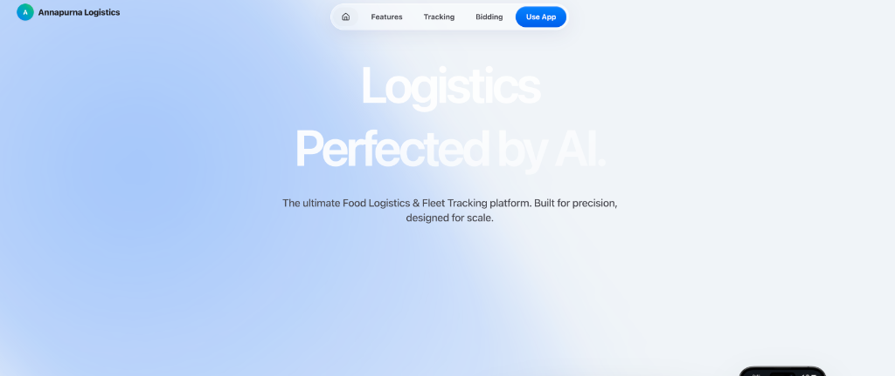
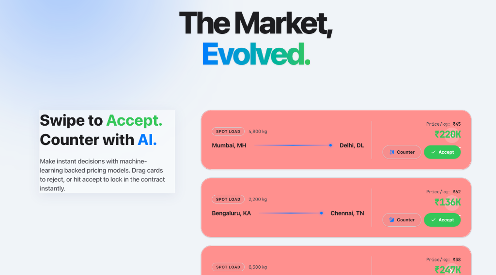
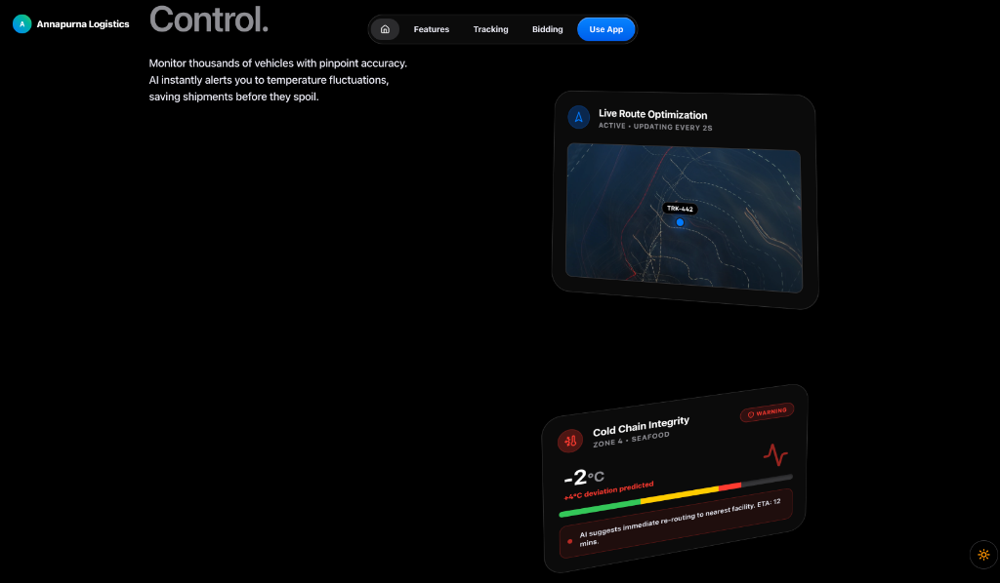
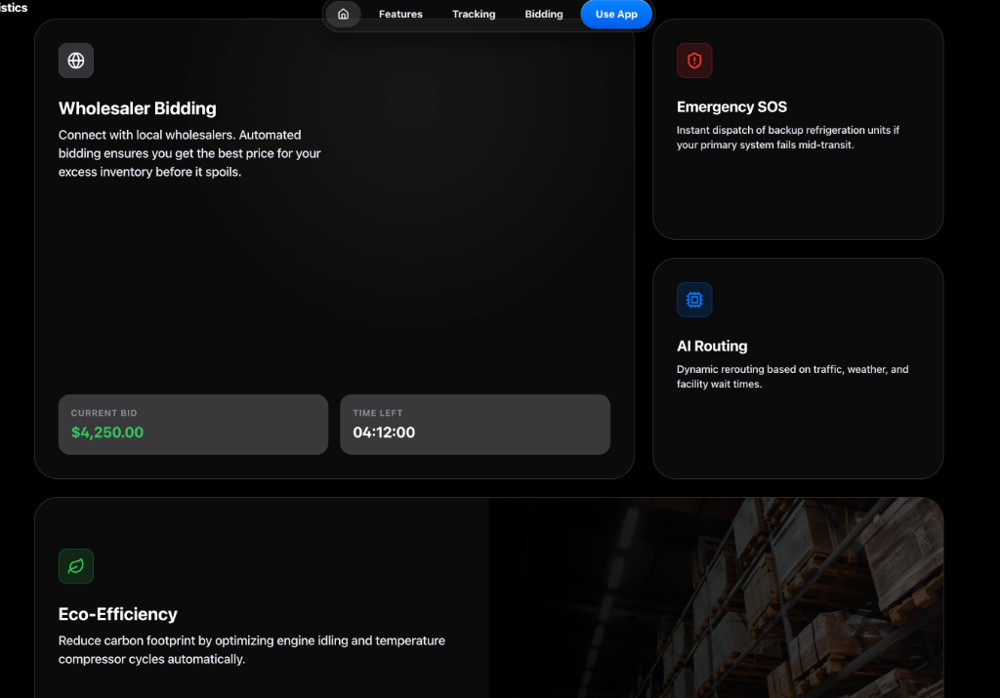
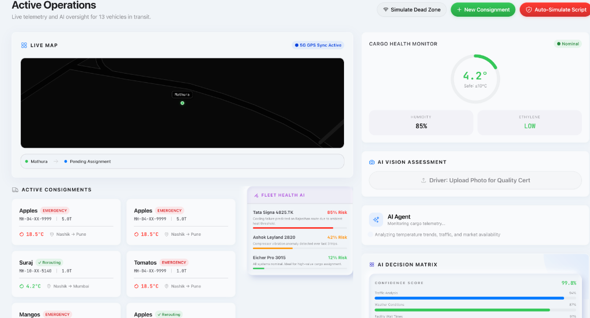
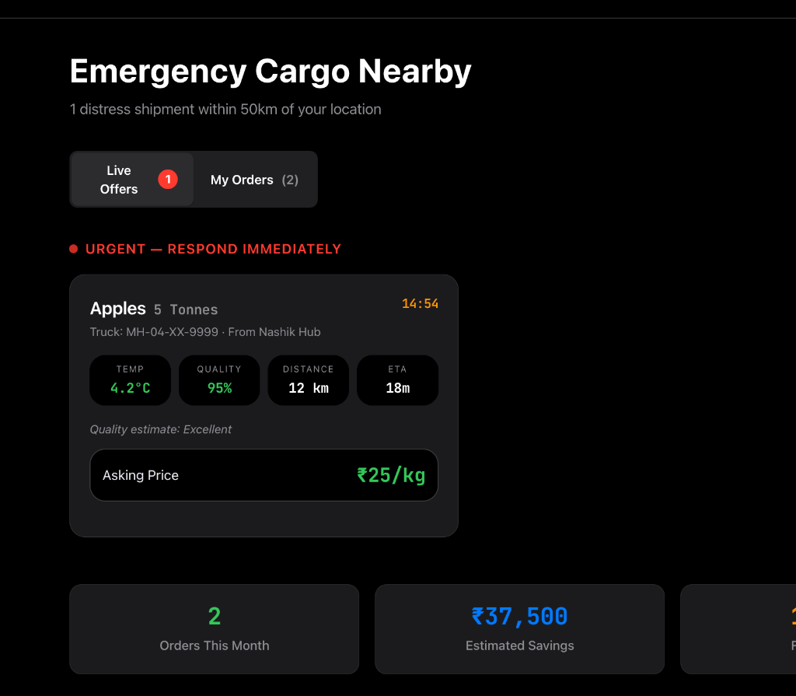
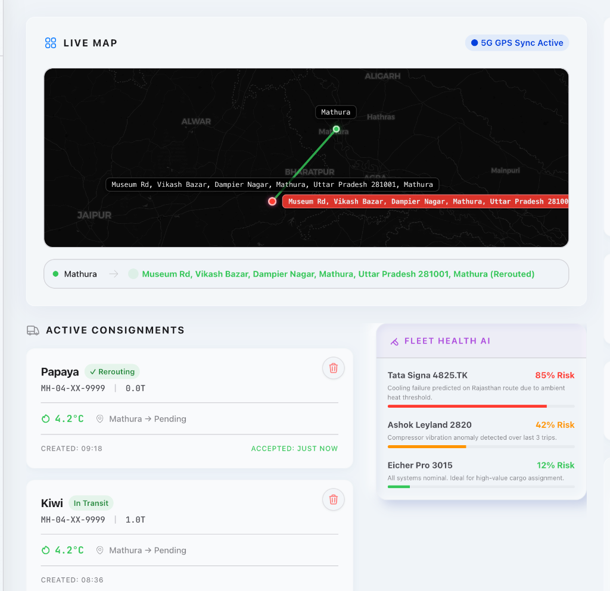
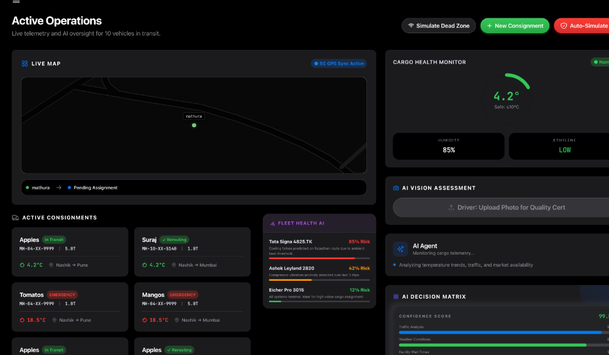
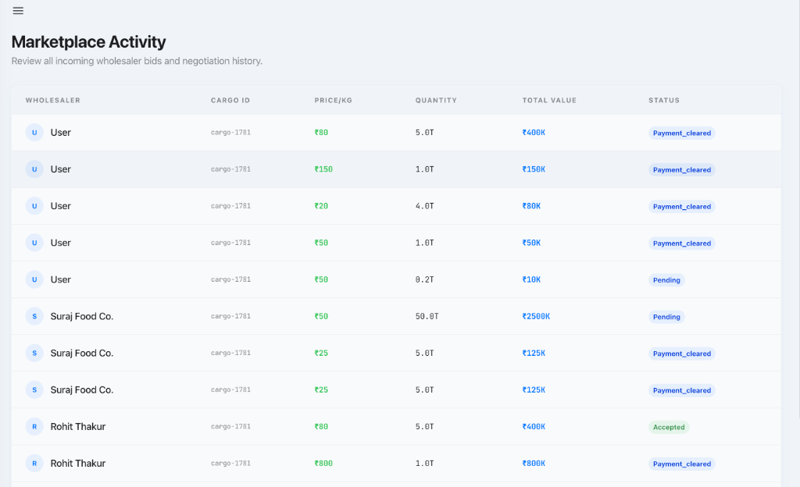
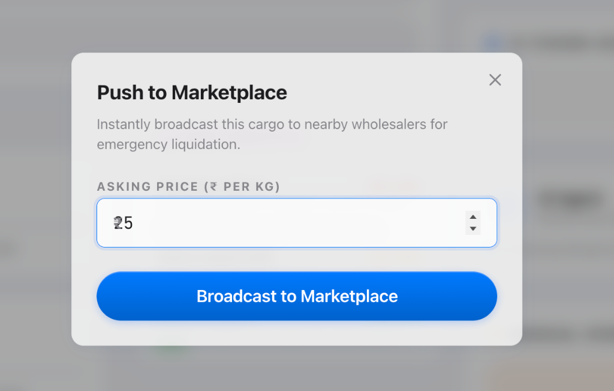

<div align="center">
  

  <h1>🏔️ Annapurna</h1>
  <h3>Logistics Perfected by AI. The ultimate Food Logistics & Fleet Tracking platform.</h3>

  <p>
    <strong>Annapurna</strong> revolutionizes supply chain management by minimizing waste, maximizing efficiency, and providing unparalleled visibility into your fleet and cargo. Built with state-of-the-art AI, premium Glassmorphism design, and real-time data synchronization.
  </p>

  <p>
    <a href="#features">Features</a> •
    <a href="#dashboards">Dashboards</a> •
    <a href="#tech-stack">Tech Stack</a> •
    <a href="#getting-started">Getting Started</a>
  </p>
</div>

---

## ✨ Features that redefine Logistics

### 🏪 The Market, Evolved
A dynamic marketplace connecting fleets with wholesalers. Instantly liquidate perishable goods in emergencies or auction excess cargo to the highest bidder with our seamless swipeable bid cards.


### 🛰️ Unprecedented Visibility & Control
Monitor your entire fleet with Live Route Optimization and Cold Chain Integrity checks.


### 🧠 Advanced AI & Telemetry
Leverage AI for Routing, Eco-Efficiency, and Fleet Health. Get predictive alerts for compressor anomalies, optimal routing based on traffic and weather, and detailed analytics on carbon footprint reduction.


---

## 🖥️ Dashboards & Interfaces

Annapurna provides dedicated, high-performance interfaces tailored for both Fleet Directors and Wholesalers, featuring "Apple HIG-based" next-level UI, Claymorphism, and seamless light/dark modes.

### 🚛 Fleet Director Dashboard
Command central for fleet managers. Monitor active consignments, live telemetry, AI decision matrices, and handle real-time rerouting.

**Light Mode Overview**
<br>


**Dark Mode Overview**
<br>


**Active Rerouting & Navigation**
<br>


---

### 🏪 Wholesaler Marketplace
A dedicated portal for wholesalers to browse incoming bids, respond to emergency cargo SOS, and manage negotiation history.

**Emergency Cargo Radar (Dark Mode)**
<br>


**Marketplace Activity & Ledger**
<br>


**Real-time Push to Marketplace**
<br>


---

## 🛠️ Tech Stack

Annapurna is built with modern, production-grade tools:
* **Framework:** Next.js 14+ (App Router), React 18
* **Styling:** Tailwind CSS, Framer Motion (for fluid animations and micro-interactions)
* **Map Engine:** Leaflet & React-Leaflet
* **Backend & Real-time Database:** Supabase
* **State Management:** React Context / Zustand
* **Design Philosophy:** Apple Human Interface Guidelines (HIG), Glassmorphism, Claymorphism, and Mesh Gradients.

---

## 🚀 Getting Started

1. **Clone the repository:**
   ```bash
   git clone https://github.com/your-username/annapurna.git
   cd annapurna
   ```

2. **Install dependencies:**
   ```bash
   npm install
   # or yarn install / pnpm install
   ```

3. **Set up environment variables:**
   Create a `.env.local` file and add your Supabase and other necessary API keys.
   ```env
   NEXT_PUBLIC_SUPABASE_URL=your_supabase_url
   NEXT_PUBLIC_SUPABASE_ANON_KEY=your_supabase_anon_key
   ```

4. **Run the development server:**
   ```bash
   npm run dev
   ```

5. **Open your browser:**
   Navigate to [http://localhost:3000](http://localhost:3000) to see the application in action.

---

<div align="center">
  <p>Everything you need. Nothing you don't.</p>
  <p><i>Made with ❤️ for the FarAway Hackathon.</i></p>
</div>
