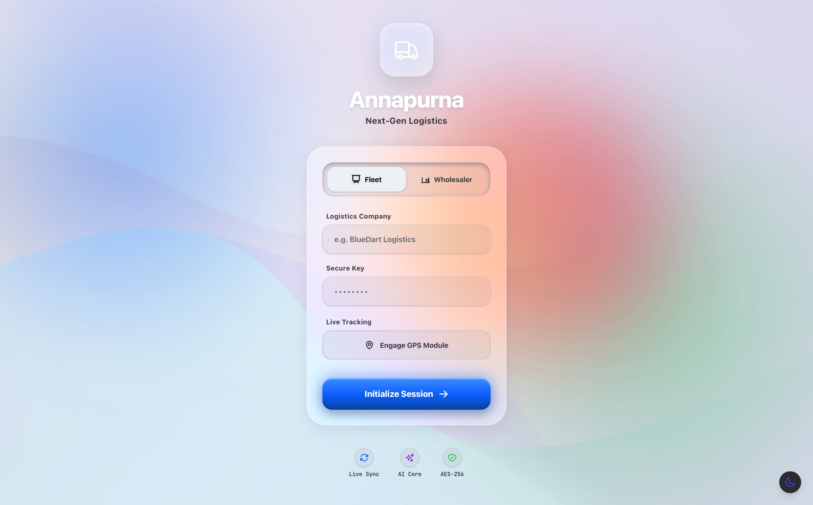
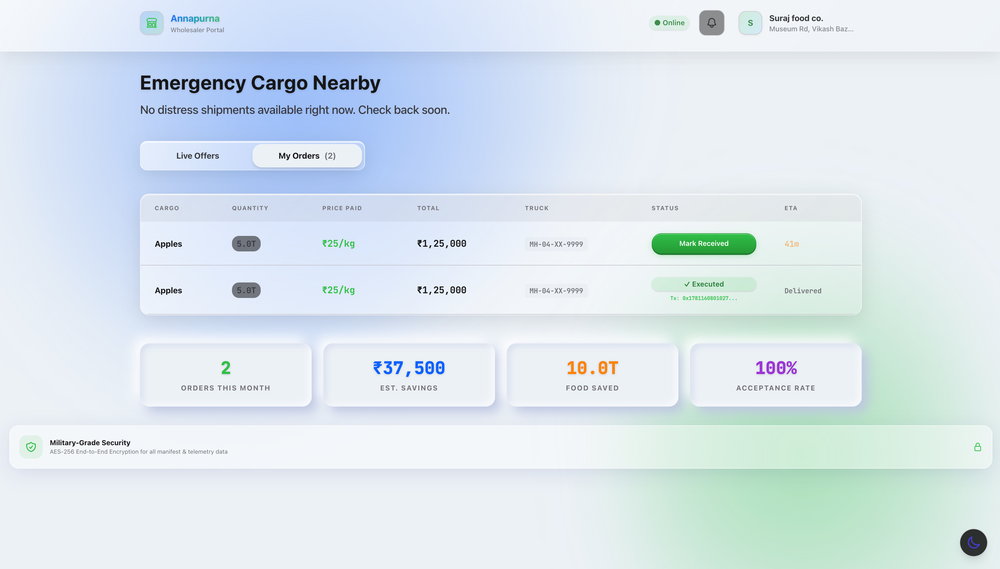

  
  
   
  
  <h1>Annapurna: Logistics Perfected by AI 🏔️</h1>
  
  

    <strong>Minimizing waste. Maximizing efficiency. Saving the harvest.</strong>
  

  
  

    <a href="#the-problem">The Problem</a> •
    <a href="#the-gap">The Gap</a> •
    <a href="#our-solution">Our Solution</a> •
    <a href="#key-features">Key Features</a> •
    <a href="#gallery">Gallery</a>
  

---

## 💔 The Problem: A Crisis in the Cold Chain

Every year, up to **40% of food produced in emerging markets is wasted** before it ever reaches a plate. This isn't just an economic loss in the billions; it's a profound human crisis. 

The primary culprit? **Broken, fragmented logistics and compromised cold chain integrity.**

Traditional logistics fleets operate with blind spots. Drivers face unpredictable weather, severe traffic, and mechanical failures. By the time a refrigeration compressor fails on a transport truck, the damage is already done. The cargo spoils, the farmer loses their livelihood, and the wholesaler receives nothing.

## 🕳️ The Gap: Reactive vs. Proactive

Currently, the logistics market relies on **reactive systems**. Telematics tell a fleet manager that a truck's temperature *has already risen*, or that a truck *has already broken down*. 

There is a massive gap in the market for an integrated, proactive solution that bridges **predictive fleet maintenance** with **real-time economic recovery**. What happens when a breakdown is inevitable? The food is simply thrown away.

## 💡 Our Solution: Annapurna

**Annapurna** is a next-generation, AI-driven logistics platform designed specifically to eradicate food waste in transit. 

We don't just track trucks; we protect perishables. By leveraging cutting-edge LLMs (powered by Groq) and real-time telemetry, Annapurna constantly monitors environmental conditions, vehicle health, and route efficiency to predict anomalies *before* they become disasters.

But we didn't stop there. 

If a truck suffers a critical cold-chain failure that cannot be mitigated, Annapurna instantly spins up an **Emergency Wholesaler Marketplace**. The platform geo-locates nearby wholesalers and allows them to bid on the distressed cargo at a discount. Instead of rotting on the highway, the food is rescued, the fleet recovers costs, and local markets get fresh produce. 

---

## ✨ Key Features

### 1. AI Fleet Command Center
Monitor your entire fleet with real-time telemetry, GPS sync, and ambient temperature tracking. Annapurna uses predictive AI to alert managers to cooling anomalies and provides intelligent rerouting to optimize fuel and protect cargo.

### 2. The Emergency Wholesaler Marketplace
When disaster strikes, the cargo doesn't have to die. Fleet managers can automatically simulate a dead zone or trigger an emergency SOS, instantly listing the cargo on a live, geo-fenced marketplace for nearby wholesalers.

### 3. Beautiful, Accessible UI
A premium, Apple HIG-inspired interface with seamless **Light and Dark Modes**. Whether you are a fleet manager working a night shift or a wholesaler in the bright sun, the UI adapts to your environment flawlessly.

---

## 📸 Gallery

We believe enterprise software should be as beautiful as it is functional. Here is a look at Annapurna in action.

### 🌓 Adaptive Lighting (Light & Dark Mode)
*Annapurna's stunning landing and login pages, built with glassmorphism and modern aesthetics.*

  
  

### 🛰️ Fleet Operations Command
*Real-time AI oversight. Track trucks, monitor compressor efficiency, and manage active consignments.*

  

 

*Live map navigation and intelligent rerouting directly to the driver.*

  

### 🤝 The Wholesaler Marketplace
*A revolutionized B2B market. Wholesalers are notified of emergency cargo nearby and can bid to save the load.*

  
  

---

  <h3>Ready to revolutionize your supply chain?</h3>
  
Join industry leaders in minimizing waste and maximizing efficiency with Annapurna's AI logistics platform.

